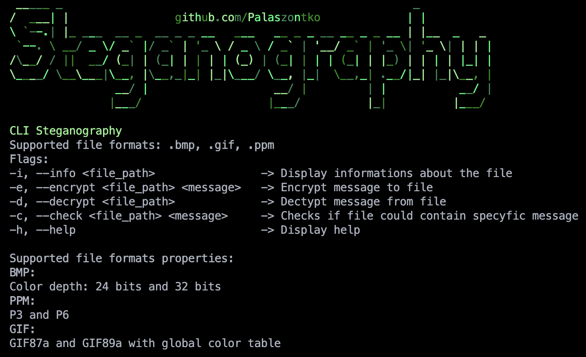

# Steganography Tool 
*Very old project from time when I was learning C++ and basics of steganography concepts*



A command-line steganography tool that allows you to hide secret messages inside image files using the LSB (Least Significant Bit) technique.

## Features

- **Multiple Image Formats Support**:
    - **BMP**: 24-bit and 32-bit color depth
    - **PPM**: Both P3 (ASCII) and P6 (binary) formats
    - **GIF**: GIF87a and GIF89a with global color table
- **LSB Steganography**: Hide messages in the least significant bits of image pixels
- **Message Encoding/Decoding**: Securely embed and extract text messages
- **File Information Display**: View detailed image properties
- **Capacity Checking**: Verify if an image can contain a specific message
- **Colorful CLI Interface**: Beautiful ASCII art and colored output

## Building

```bash
mkdir build && cd build
cmake ..
make
```

The executable will be created as `steganography` in the build directory.

## Usage

```bash
# Display help
./steganography -h

# Show file info
./steganography -i image.bmp

# Hide message
./steganography -e image.bmp "secret message"

# Extract message
./steganography -d image.bmp

# Check capacity
./steganography -c image.bmp "test message"
```

## Supported File Formats

- **BMP** (.bmp) - 24-bit and 32-bit Windows Bitmap
- **PPM** (.ppm) - P3 (ASCII) and P6 (Binary) Portable Pixmap  
- **GIF** (.gif) - GIF87a and GIF89a with global color table

## Project Structure

```
steganography/
├── src/                 # Source files (.cpp)
├── include/             # Header files (.hpp)  
├── Steganography/       # Test images
├── build/               # Build output
└── CMakeLists.txt       # Build config
```

## Limitations

- **GIF files**: Limited message capacity (hardcoded to 768 bits)
- **No encryption**: Messages are hidden but not encrypted

## License

This project is open-source and available under the [MIT License](LICENSE).